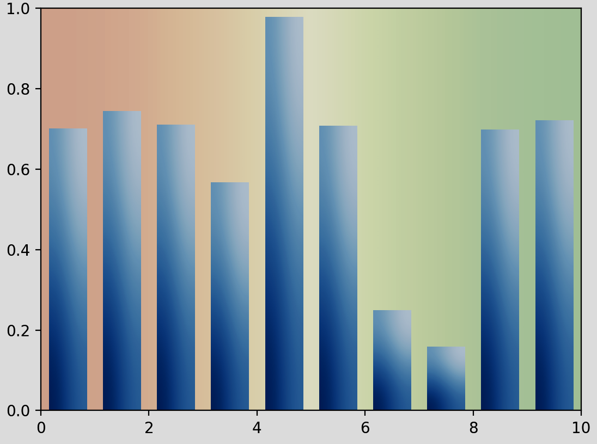

# Data Analysis and Visualization Programming (Using Modules and UV)

# CS101 Spring 2026: Lab 07

🚀 This assignment will allow you to gain hands-on experience with **data analysis and visualization in Python** while learning about real-world data processing workflows using modules that you will create yourself, and import from Python's wonderful collection of libraries.

By the end of this lab, you will understand how data scientists and analysts work with CSV files, perform statistical transformations, and create meaningful visualizations to tell stories with data. Get ready to unlock the power of data, driven by modules! Neat-O, right?! 📊✨

## Assigned and Due

**Two week lab**

* __Assigned__: Friday, 27th March 2026 at 2:35pm 
* __Due__: Friday, 10th April 2026 at 2:35pm
* __Expiration Date__: Friday, 17th April 2026 at 2:35pm
Note: the _expiration_ date is the last date you can submit your work for a grade.


Data visualization helps us understand patterns, trends, and insights hidden in numerical data. In this figure, we see how different transformations can reveal different aspects of the same dataset.

🚀 Good luck, and happy coding as you dive into the world of data analysis! 📈→💡

## 🎯 Learning Objectives

By the completing this assignment, you will know how to implement the following amazing skills in Python.

- How to read and validate CSV data files in Python
- What statistical transformations are and why they are useful in data analysis
- How to create meaningful data visualizations using matplotlib
- How to use validation techniques to ensure that your code runs as expected, in addition to basic error handling
- How modular programming makes complex projects manageable (and maintainable!)
- Real-world data analysis workflows used by professionals

## 📊 Why Data Analysis Matters

### The Data Revolution

When was the last time you looked at a graph or chart (or even checked your phone!) to understand something? It was likely only minutes ago!

We live in an age where data is everywhere! From weather patterns and stock prices to social media metrics and scientific measurements, numerical data helps us understand our world. But raw numbers by themselves do not tell stories - we need tools and techniques to make sense of all this data. Notably, we use code to make all the follow happen.

1. **Load and validate data** - Ensuring our data is clean and usable
2. **Transform data** - Converting raw numbers into meaningful insights
3. **Visualize patterns** - Making complex data understandable at a glance

### Statistical Transformations: Making Data Tell Better Stories by Adjusting the Viewpoint

In this lab, we will use code from modules to transform data into different types of numbers so that we can view with a different perspective to uncover hidden patterns. To change a value into another type of value, we use statistical transformations that come from the following functions, available in the `math` module.

#### Logarithmic Transformation (log)

```
y = log(x) # math.log(x)
```

**When to use**: When your data spans many orders of magnitude (like population sizes or financial data)

**What it does**: Compresses large values while expanding small values, making patterns more visible

#### Exponential Transformation (exp)  

```
y = e^x # math.exp(x)
```

**When to use**: When modeling growth patterns or converting log-transformed data back to original scale
**What it does**: Amplifies differences in your data, useful for highlighting exponential trends

#### Square Root Transformation (sqrt)

```
y = √x  # math.sqrt(x)
```

**When to use**: When you have count data or want to reduce the impact of outliers
**What it does**: Reduces the influence of extremely large values while preserving relationships

## 🔧 Your Mission: Be a Data Detective!

What do do, you ask?!

Here you will uncover some of the truth behind the data.🕵️‍♀️

In this lab, you will build a complete data analysis pipeline by creating (or, debugging) **three separate Python modules** which are Python code files that the `main.py` driver program will depend on for execution. These modules are to be integrated into the main (*driver*) program.

This will help you get some practice using modular programming which is a key skill for writing maintainable, professional code.

The modes are listed below, along with the functions that they contain, and the TODOs that you are to address.

### Module 1: `modules/data_loader.py` 📁

**Your File Loading and Validation Module**

- `load_csv_file()`: Read CSV files safely with proper error handling
- `validate_numerical_data()`: Check that files contain numerical data
- `get_data_summary()`: Calculate basic statistics (mean, median, std, min, max)
- `process_data_file()`: Complete pipeline combining all data loading steps

**TODOs 1-5**: Import pandas/numpy, implement CSV reading, data validation, and statistics

### Module 2: `modules/transformations.py` 🔄

**Your Statistical Transformation Module**

- `apply_log_transformation()`: Logarithmic transformation with negative value handling
- `apply_exp_transformation()`: Exponential transformation with overflow protection
- `apply_sqrt_transformation()`: Square root transformation for count data
- `validate_transformation_input()`: Input validation for mathematical operations

**TODOs 6-11**: Import numpy, implement all three transformations with proper error handling

### Module 3: `modules/plotting.py` 📊

**Your Data Visualization Module**

- `create_plot()`: Professional line plots with labels and formatting
- `create_comparison_plot()`: Side-by-side original vs transformed data plots
- `create_all_transformations_plot()`: Multi-panel comparison view
- `setup_plot_style()`: Consistent matplotlib styling

**TODOs 12-17**: Import matplotlib, create plotting functions, save high-quality images

### Main Program: `main.py` 🎯

**Integration and User Interface**

- Import and coordinate your three custom modules
- Interactive command-line interface for file and transformation selection
- Error handling and user-friendly feedback
- Complete data analysis workflow

**TODOs 18-27**: Import your modules, integrate functions, create menu system, add error handling

🐛 **Modular Programming Challenge**: You will see how to write clean, reusable code by separating tasks into focused modules to handle the task. Each module has a specific purpose, making the code easier to understand, test, and maintain (by yourself, and others too!)

---

## Getting Started

We will be using the `uv` tool to manage dependencies and run the code in this project. If you have not installed `uv` yet, please follow the instructions at https://docs.astral.sh/uv/getting-started/installation/ to get the package manager installed.

### Setting Up Your Python Environment with UV

**The uv steps to get started:**

1. **Initialize the project** (creates `pyproject.toml` and sets up the project structure):
   
   If you're starting from scratch, initialize the project:
   
   ```bash
   uv init
   ```
   
   Note: If the `pyproject.toml` file already exists in your repository, you can skip this step.

2. **Add required dependencies** (pandas, matplotlib, and numpy):
   
   ```bash
   uv add pandas matplotlib numpy
   ```
   
   This command adds the necessary data analysis and visualization libraries to your `pyproject.toml` file.

3. **Create and sync the virtual environment** (creates `.venv/` directory and installs all dependencies):
   
   ```bash
   uv sync
   ```
   
   This command:
   - Automatically creates a virtual environment in the `.venv/` directory if it doesn't exist
   - Installs all dependencies listed in `pyproject.toml`
   - Locks the dependency versions in `uv.lock` for reproducibility

4. **Try running the main program**:

   ```bash
   uv run main.py
   ```
   
   The `uv run` command automatically activates the virtual environment and runs your Python script.

### Understanding the Files Created

After running the setup commands, you'll see these new files and directories:

- **`pyproject.toml`**: Project configuration file that lists dependencies and project metadata
- **`uv.lock`**: Lock file ensuring everyone uses the same dependency versions
- **`.venv/`**: Virtual environment directory containing Python and all installed packages (should be in `.gitignore`)

### Sample Data

The project includes sample CSV files with different types of numerical data that you can apply to your code to analyze.

- `data/temperature_data.csv` - Daily temperature readings
- `data/population_data.csv` - City population figures  
- `data/stock_prices.csv` - Historical stock price data

### Types of Challenges You Will Encounter

🔍 **Import Errors**: Missing `import` statements for data analysis libraries  
🔍 **File Handling**: Proper CSV reading with pandas  
🔍 **Data Validation**: Checking for numerical data vs. text  
🔍 **Mathematical Errors**: Handling edge cases in transformations (log of negative numbers, etc.)  
🔍 **Plotting Issues**: Matplotlib configuration and formatting  
🔍 **Error Handling**: Graceful failure when files do not exist or data is invalid  
🔍 **Data Type Issues**: Converting strings to numbers properly  
🔍 **Index Errors**: Handling empty datasets or missing columns  

### How to Debug Effectively

1. **Read error messages carefully** - Python tells you exactly what's wrong and where!
2. **Follow TODO comments in order** - They are numbered to guide your progress
3. **Test frequently** - Run the code after each fix to see your progress  
4. **Check sample outputs** - Compare your results to the expected outputs below
5. **Use print statements** - Add temporary debug prints to understand data flow

## TODO To Fix

What are the tasks to complete in this project? Below we have a list of them for a bird's eye view. Remember to hit those TODOs in order for best results!

### **Phase 1: Data Loading Module (TODOs #1-5)**

**File: `modules/data_loader.py`**

- **TODO #1**: Import pandas and numpy for data operations
- **TODO #2**: Implement `load_csv_file()` using pandas.read_csv()  
- **TODO #3**: Complete `validate_numerical_data()` using select_dtypes()
- **TODO #4**: Finish `get_data_summary()` with statistical calculations
- **TODO #5**: Optional module testing function

### **Phase 2: Transformations Module (TODOs #6-11)**

**File: `modules/transformations.py`**

- **TODO #6**: Import numpy for mathematical operations
- **TODO #7**: Complete `apply_log_transformation()` with negative handling
- **TODO #8**: Implement `apply_exp_transformation()` with overflow protection
- **TODO #9**: Finish `apply_sqrt_transformation()` for count data
- **TODO #10**: Enhance input validation (optional)
- **TODO #11**: Optional module testing function

### **Phase 3: Plotting Module (TODOs #12-17)**

**File: `modules/plotting.py`**

- **TODO #12**: Import matplotlib.pyplot for visualization
- **TODO #13**: Configure professional plot styling (optional)
- **TODO #14**: Complete `create_plot()` with matplotlib functions
- **TODO #15**: Implement `create_comparison_plot()` with subplots
- **TODO #16**: Advanced multi-plot visualization (optional challenge)
- **TODO #17**: Optional module testing function

### **Phase 4: Integration and Main Program (TODOs #18-27)**

**File: `main.py`**

- **TODO #18**: Import your three custom modules
- **TODO #19**: Input validation (already complete)
- **TODO #20**: Integrate transformations module in menu system
- **TODO #21**: Integrate plotting module for visualizations
- **TODO #22**: Comprehensive transformation analysis
- **TODO #23**: Module availability checking
- **TODO #24**: Data loading integration with data_loader module
- **TODO #25**: Complete transformation and visualization pipeline
- **TODO #26**: Enhanced error handling and user feedback
- **TODO #27**: Final integration testing checklist

## 📊 Expected Sample Output

Once you fix all the TODOs, your program should produce output like this:

```text
Data Analysis and Visualization Tool
==================================================
This program analyzes numerical data from CSV files and creates visualizations.

Available data files:
1. data/temperature_data.csv (Daily temperatures)
2. data/population_data.csv (City populations)  
3. data/stock_prices.csv (Historical stock prices)
4. Load your own CSV file

Enter your choice (1-4): 1

Loading file: data/temperature_data.csv
✓ File loaded successfully!
✓ Data validation passed - 365 numerical data points found
✓ Data range: -15.2°C to 38.7°C

Choose transformation:
1. Logarithmic (log)
2. Exponential (exp)  
3. Square Root (sqrt)
4. No transformation
5. Compare all transformations

Enter your choice (1-5): 5

Generating visualizations...
✓ Original data plot saved as 'plots/temperature_original.png'
✓ Log transformation plot saved as 'plots/temperature_log.png'  
✓ Exponential transformation plot saved as 'plots/temperature_exp.png'
✓ Square root transformation plot saved as 'plots/temperature_sqrt.png'
✓ Comparison plot saved as 'plots/temperature_comparison.png'

Data Summary Statistics:
========================
Original Data:
  Mean: 12.4°C
  Median: 13.1°C  
  Std Dev: 15.8°C
  Min: -15.2°C
  Max: 38.7°C

Log Transformation (offset applied for negative values):
  Mean: 3.2
  Median: 3.3
  Std Dev: 0.8
  
Visualizations complete! Check the 'plots/' directory for your charts.
```

### 🧮 What This Output Teaches You

1. **Data validation is crucial**: Always check your data before processing
2. **Transformations reveal different patterns**: Each transformation highlights different aspects  
3. **Edge cases matter**: Negative numbers need special handling for log transformation
4. **Summary statistics provide context**: Mean, median, and standard deviation help interpret results
5. **File organization helps**: Saving plots with descriptive names aids analysis

## 🎨 Visualization Examples

Your program will generate several types of plots:

### Original Data Plot

- Time series showing raw temperature data over days
- Clear axis labels and title
- Grid for easy reading

### Transformed Data Plots

- Log transformation revealing multiplicative patterns
- Exponential transformation amplifying differences
- Square root transformation reducing outlier impact

### Comparison Plot

- Side-by-side subplots showing original vs transformed data
- Consistent scaling for easy comparison
- Color-coded legends

## 💡 Advanced Debugging Tips

### Common Data Analysis Errors

- **`pandas not found`**
  - **Fix**: Add `import pandas as pd` to your imports
  
- **`FileNotFoundError: data/temperature_data.csv`**
  - **Fix**: Check file path and ensure data directory exists
  
- **`ValueError: math domain error in log`**  
  - **Fix**: Handle negative numbers by adding offset or using absolute values
  
- **`TypeError: unsupported operand type(s) for log`**
  - **Fix**: Ensure data is numeric, use `pd.to_numeric()` to convert

### Testing Your Progress

After each fix, verify:

1. Error messages disappear
2. Files load without crashing  
3. Transformations produce reasonable results
4. Plots are generated and saved properly
5. Data validation catches bad inputs correctly

## 🧪 Testing

If you are interested in optionally testing your modules as you go, then read on.

Note: Each module includes optional testing functions (TODOs #5, #11, #17) that you can use to verify your implementations work correctly. Below are some commands to run the tests.

### Running Individual Module Tests

**Test the Data Loader Module:**

```bash
uv run python -c "from modules.data_loader import test_data_loader; test_data_loader()"
```

**Test the Transformations Module:**

```bash
uv run python -c "from modules.transformations import test_transformations; test_transformations()"
```

**Test the Plotting Module:**

```bash
uv run python -c "from modules.plotting import test_plotting; test_plotting()"
```

### Alternative: Direct Module Execution

If you have uncommented the test functions (which are at the bottom of the module source code), then you can run each module directly. (Otherwise, you will likely get some kind of unexpected output.)

```bash
# Test individual modules
uv run modules/data_loader.py
uv run modules/transformations.py  
uv run modules/plotting.py
```

### Running All Tests at Once

Use the provided test-runner script to run your tests all at once.

```bash
uv run run_tests.py
```

### Understanding Test Output

#### Data Loader Module Test Output

```text
Testing data_loader module...
Attempting to load file: data/temperature_data.csv
✓ File loaded successfully! Shape: (365, 1)
✓ Data validation passed - 365 numerical data points found
✓ Numerical columns: ['temperature']
✅ Data loader module test passed!
```

**Understanding the output:**

* ✅ **File loaded successfully**: Your CSV reading function works
* ✅ **Data validation passed**: Your numerical data detection works  
* ✅ **365 data points found**: Correct number of temperature readings loaded
* ✅ **Test passed**: All data loading functions are working correctly

#### Transformations Module Test Output

```text
Testing transformations module...
Original data: [ 1  4  9 16 25 36]
Log result: [0.         1.38629436 2.19722458 2.77258872 3.21887582 3.58351894]
Exp result: [2.71828183e+00 5.45981500e+01 8.10308393e+03 8.88611052e+06
             7.20048993e+10 4.31123155e+15]
Sqrt result: [1. 2. 3. 4. 5. 6.]
✅ Transformations module test passed!
```

**Understanding the output:**

* ✅ **Log transformation**: Correctly converts [1,4,9,16,25,36] to logarithmic values
* ✅ **Exp transformation**: Properly calculates exponential values (note the scientific notation for large numbers)
* ✅ **Sqrt transformation**: Perfect square roots [1→1, 4→2, 9→3, 16→4, 25→5, 36→6]
* ✅ **Test passed**: All mathematical transformations are working correctly

#### Plotting Module Test Output

```text
Testing plotting module...
✓ Plot saved successfully: plots/test_basic.png
✓ Comparison plot saved successfully: plots/test_comparison.png  
✅ Plotting module test passed!
```

**Understanding the output:**

* ✅ **Basic plot saved**: Your `create_plot()` function works and saves files
* ✅ **Comparison plot saved**: Your `create_comparison_plot()` function works
* ✅ **Test passed**: All plotting functions are creating and saving visualizations correctly

### Integration Testing with Main Program

The ultimate test is running the complete program:

```bash
uv run main.py
```

**Successful integration output should show:**

```text
📊 DATA ANALYSIS AND VISUALIZATION TOOL 📊
Available data files:
1. data/temperature_data.csv (Daily temperatures)
2. data/population_data.csv (City populations)  
3. data/stock_prices.csv (Historical stock prices)
4. Load your own CSV file

Enter your choice (1-4): 
```

### Common Test Errors and Fixes

* **Import Error: No module named 'pandas'**
  * **Fix**: Ensure you've run the setup commands: `uv add pandas matplotlib numpy` followed by `uv sync` to install dependencies

* **Import Error: cannot import name 'test_data_loader'**  
  * **Fix**: Uncomment the test function in the module file (remove the `"""` triple quotes)

* **Test failed: 'NoneType' object has no attribute 'shape'**
  * **Fix**: Complete TODO #2 (implement pandas CSV reading) before testing

* **FileNotFoundError: data/temperature_data.csv**
  * **Fix**: Make sure you're running tests from the project root directory

### Test-Driven Development Approach

**Recommended workflow:**

1. **Complete TODOs 1-5** in `data_loader.py` → Test with data loader module test
2. **Complete TODOs 6-11** in `transformations.py` → Test with transformations module test  
3. **Complete TODOs 12-17** in `plotting.py` → Test with plotting module test
4. **Complete TODOs 18-27** in `main.py` → Test with full program integration
5. **Run all tests** together to verify complete system functionality

## 🔬 Advanced Exploration (Optional)

If you have time, once you've completed all the TODOs, try these *optional* extensions to give yourself an extra challenge. Why not?!

1. **Add new transformations**: Implement reciprocal (1/x) or polynomial transformations
2. **Enhanced statistics**: Add quartiles, skewness, or correlation analysis  
3. **Interactive plots**: Use plotly for interactive visualizations
4. **Data filtering**: Add options to analyze subsets of data (date ranges, value ranges)
5. **Multiple file analysis**: Compare datasets from different CSV files

Note: You may have to lookup documentation or examples to implement these features.

## 📋 Assignment Deliverables

When you complete this assignment, submit the following items to your GitHub repository. 

Note: Submitting your plots is not necessary. 📝

1. **Fixed Source Code**: `main.py` with all TODOs resolved
   - All 15 TODOs completed and tested
   - Program runs without errors
   - Interactive menu functions properly  
   - All visualizations generate correctly
   - Data validation works for various inputs

2. **Completed Reflection**: `writing/reflection.md` with thoughtful responses
   - All reflection questions answered completely
   - Demonstrates understanding of data analysis concepts
   - Shows insights from debugging and programming experience

## Submission

🚀 As you work on your lab, commit and push regularly using these commands:

```bash
git add -A
git commit -m "Your descriptive commit message here"
git push
```

**Important**: After pushing, visit your GitHub repository in a browser to verify your files uploaded correctly!

## Project Assessment

Your grade will be based on:

* **GitHub Actions CI Build Status [10%]**: Your final build before the deadline must pass all automated checks. Avoid clustering commits at the deadline - work consistently throughout the assignment period.

* **Mastery of Technical Writing [25%]**: Your `writing/reflection.md` responses should demonstrate clear writing skills and technical understanding. Proper spelling, grammar, Markdown formatting, and accurate technical content are required.

* **Mastery of Technical Knowledge and Skills [65%]**: Your `main.py` implementation should show mastery of:
  - File I/O and CSV data handling
  - Statistical transformations and mathematical operations  
  - Data visualization with matplotlib
  - Error handling and input validation
  - Modular programming and code organization
  - Effective commenting and code documentation

## Seeking Assistance

Students with questions are encouraged to:
- Ask in the course Discord channel
- Attend instructor or TL office hours  
- Collaborate appropriately while maintaining academic integrity

Remember: Learning to debug and solve problems independently is a crucial skill, but do not hesitate to seek help when needed!

(Sorry this readme document was so long... There was just a lot to cover!)
